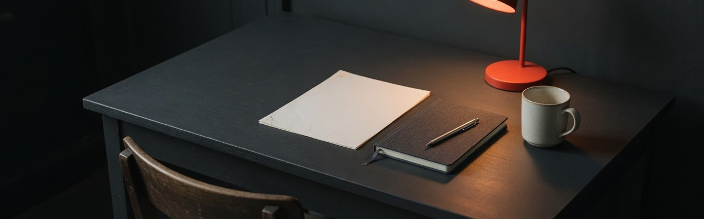
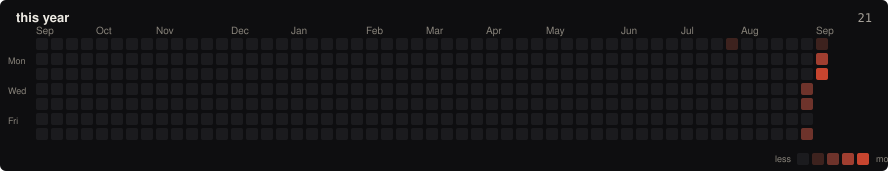
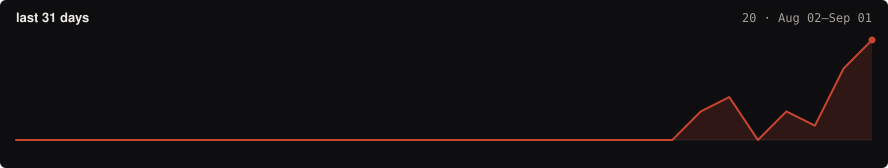

  

  <strong>一天从坐下那一刻开始。</strong> 
  snooze26h · 北京交通大学 · 本科 · <a href="https://x.com/snooze26h">X</a> · <a href="mailto:snooze062@gmail.com">mail</a>

作息不绑钟点，所以工具也不该绑钟点。我在做能坐得住的系统：把一天记成配额而不是课表，把笔记整理成以后还用得上的记录。

**正在做**

- **[Sitzfleisch](https://github.com/snooze26h/sitzfleisch-swift)** — 从坐下开始计时的 macOS 学习管家。离开是一等公民，验收过的时间才算数。
- **[snooze26h-blog](https://github.com/snooze26h/snooze26h-blog)** — 中英双语个人博客。私人笔记留过程，公开文字留结论。

**在看**

研究方法、工程实践、知识管理。不追求日更，只公开值得反复读的东西。

---

  

  

