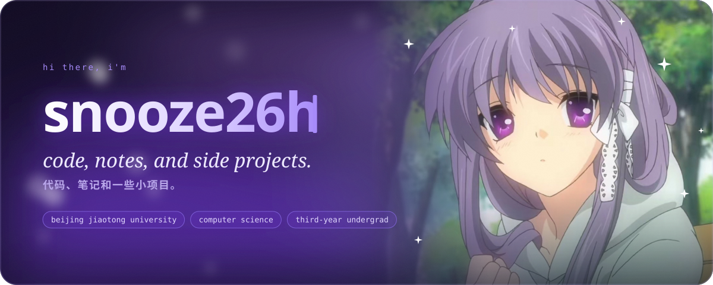
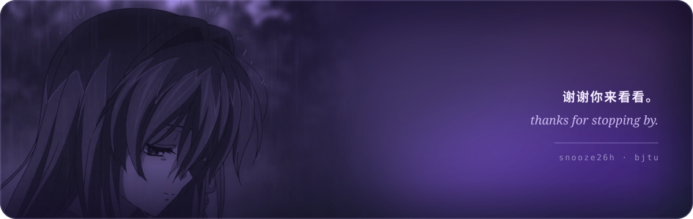

<picture>
  <source media="(prefers-color-scheme: dark)" srcset="assets/hero-dark.svg">
  <source media="(prefers-color-scheme: light)" srcset="assets/hero-light.svg">
  
</picture>

### ✦ about

- 🎓 Third-year undergraduate in **Computer Science and Technology** at **Beijing Jiaotong University**
- 📫 [snooze062@gmail.com](mailto:snooze062@gmail.com) · [X @snooze26h](https://x.com/snooze26h)

<picture>
  <source media="(prefers-color-scheme: dark)" srcset="assets/divider-dark.svg">
  <source media="(prefers-color-scheme: light)" srcset="assets/divider-light.svg">
  
</picture>

### ✦ stats

<picture>
  <source media="(prefers-color-scheme: dark)" srcset="https://raw.githubusercontent.com/snooze26h/snooze26h/output/stats-dark.svg">
  <source media="(prefers-color-scheme: light)" srcset="https://raw.githubusercontent.com/snooze26h/snooze26h/output/stats-light.svg">
  
</picture>
<picture>
  <source media="(prefers-color-scheme: dark)" srcset="https://streak-stats.demolab.com?user=snooze26h&border_radius=16&background=140%2C1a1033%2C120b22&border=3b2a6b&stroke=3b2a6b&ring=b48cff&fire=e9d5ff&currStreakNum=f5f3ff&sideNums=e9d5ff&currStreakLabel=c4b5fd&sideLabels=a78bfa&dates=8b7fb0&card_width=445">
  <source media="(prefers-color-scheme: light)" srcset="https://streak-stats.demolab.com?user=snooze26h&border_radius=16&background=140%2Cfbf9ff%2Cf1ecff&border=ddd0fb&stroke=ddd0fb&ring=7c3aed&fire=a21caf&currStreakNum=3b0d8a&sideNums=4c1d95&currStreakLabel=6d28d9&sideLabels=7c3aed&dates=8b7fb8&card_width=445">
  
</picture>

<picture>
  <source media="(prefers-color-scheme: dark)" srcset="https://raw.githubusercontent.com/snooze26h/snooze26h/output/calendar-dark.svg">
  <source media="(prefers-color-scheme: light)" srcset="https://raw.githubusercontent.com/snooze26h/snooze26h/output/calendar-light.svg">
  
</picture>

<picture>
  <source media="(prefers-color-scheme: dark)" srcset="https://raw.githubusercontent.com/snooze26h/snooze26h/output/snake-dark.svg">
  <source media="(prefers-color-scheme: light)" srcset="https://raw.githubusercontent.com/snooze26h/snooze26h/output/snake-light.svg">
  
</picture>

<picture>
  <source media="(prefers-color-scheme: dark)" srcset="assets/footer-dark.svg">
  <source media="(prefers-color-scheme: light)" srcset="assets/footer-light.svg">
  
</picture>

art · CLANNAD © Key · Kyoto Animation

